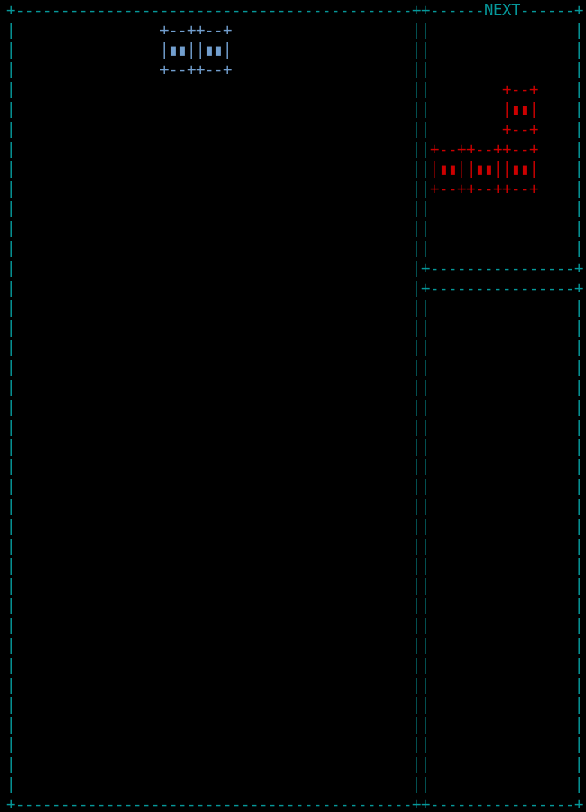
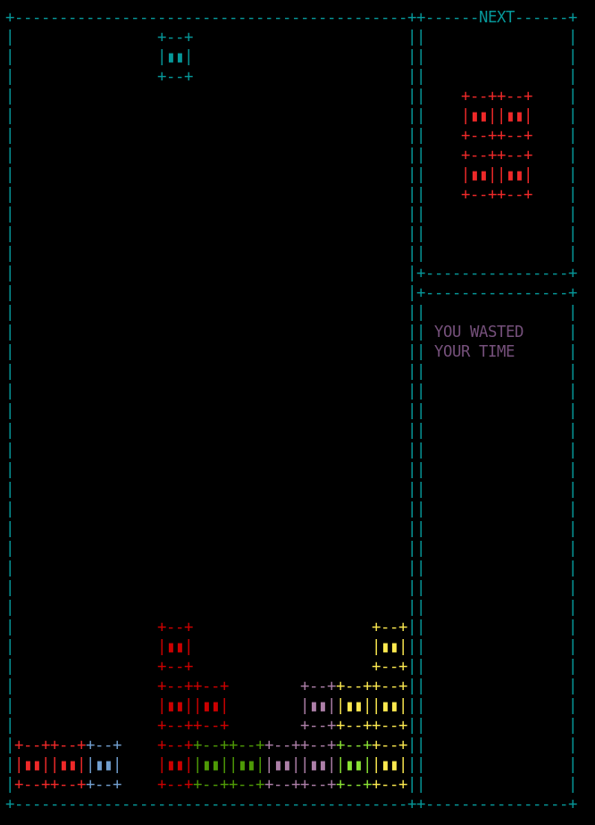

# wastedris

Trashy tetris when I personally practice to use the non-canonical mode.





# compilation

```
mkdir build
cd build
cmake ..
make
```

And you can run the program
```
./wastedris
```

